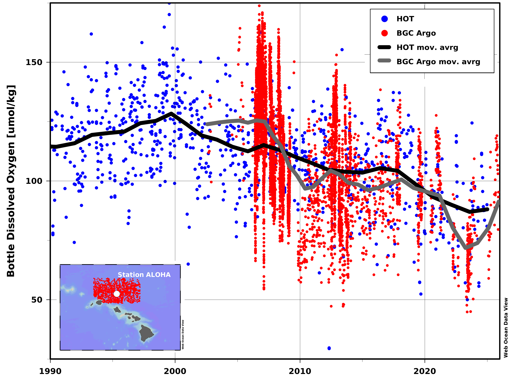
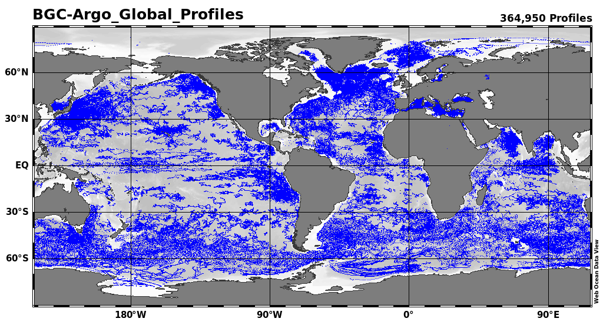
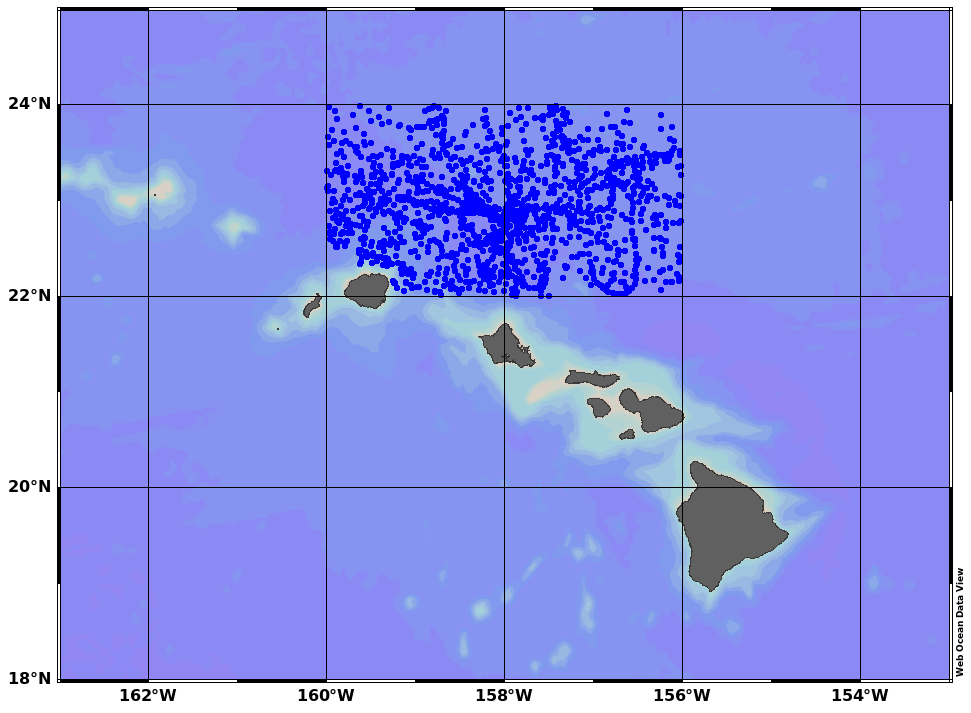
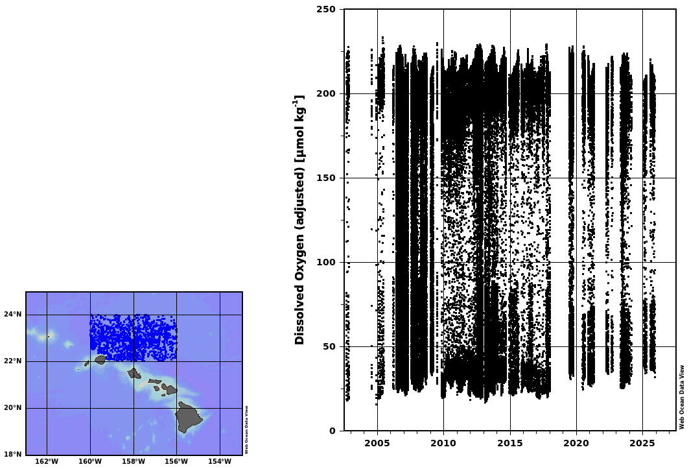

# webodv-cross-server-integration
Step-by-step tutorial on webODV's cross-server integration function.

In this example we show how to use webODV's cross-server integration -
the ability to pull in data from multiple servers and overlay them in
a unified visual and analytical framework.

 
*HOT (station ALOHA, white dot on map) oxygen data between 480 - 520 dbar
are shown as blue dots with an overlaid black moving average
line. Individual BGC Argo oxygen data (red dots on map) for the same
interval retrieved via webODV’s cross-server integration have been
overlaid (red dots plus gray moving average line). The combination of
ship-based Niskin measurements with autonomous float observations
demonstrates how webODV facilitates direct comparison of complementary
datasets without preprocessing or downloading.*

## Open the BGC Argo dataset

In your webbrowser visit https://argo-webodv.vm.fedcloud.eu/, login
and choose *Ocean->Biogeochemistry->BGC-Argo Global Profiles*. On the
next page click on *Data Exploration*.  
Choose *View->Load View->public->AllStationsMap*.

 

## Domain

Right click into the map and choose *Properties*. On the dialog select
*Domain* and enter *West=197*, *East=207*, *North=25*, *South=18* and
click on *Apply*.

## Filter Stations

Again, right click into the map and choose *Station
Filter->Customize*. On the dialog select Domain and enter *West=200*, *East=204*, *North=24*, *South=22*.
Then, on the dialog, select *Availability* and click on *8. Dissolved Oxygen (adjusted) [umol kg-1]*
and click on *Apply*. Right click on the black text on the map and click on *Delete Object* to remove the text.

 

## Create Scatter Window and Derived Variables

Left click into the white area next to the map (the *canvas*). On the
dialog choose *Layout->Layout Templates->1 SCATTER WINDOW*. Next click
choose *View->Derived Variables*, on the dialog open the *Time* node
and select *Time (station date/time)*. Click *Apply*.  
Right click into the Scatter Window, on the dialog select *X-Variable*
and choose *drvd: Time (station date/time)*. Repeat for *Y-Variable*
and choose *8. Dissolved Oxygen (adjusted) [umol kg-1]*.

 

## Filter Depth

Right click into the Scatter Window
