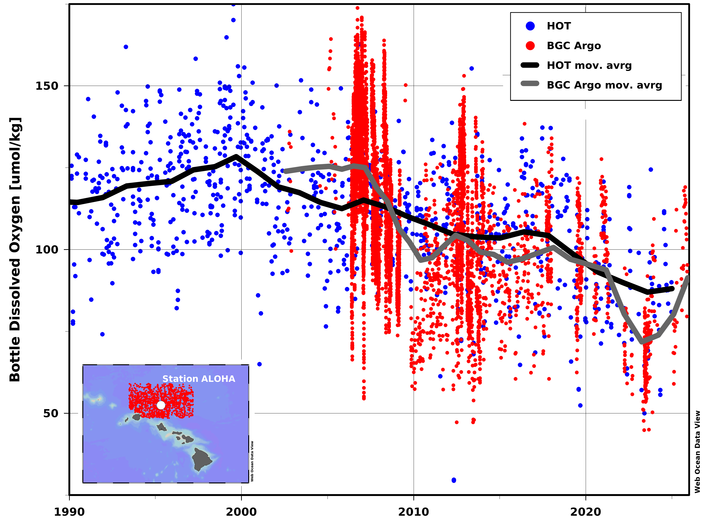
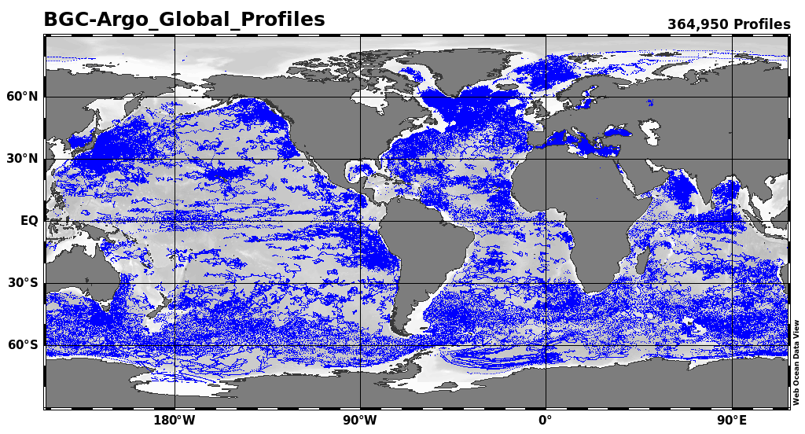
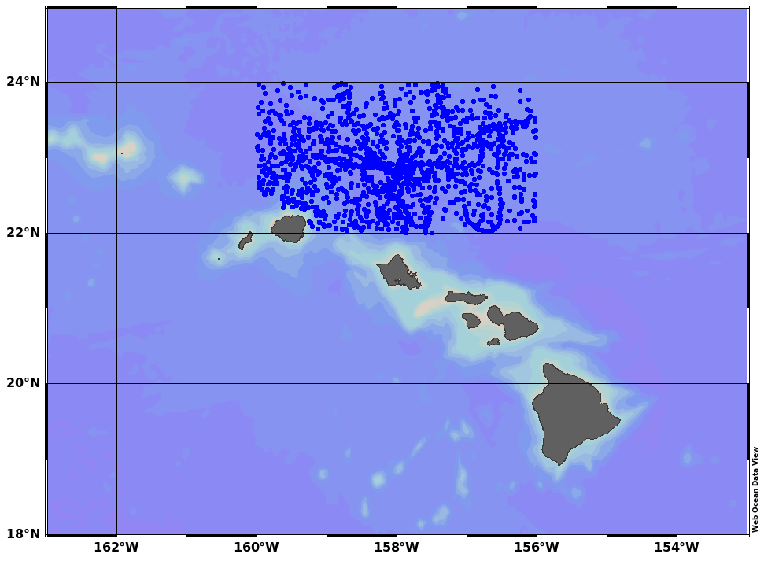
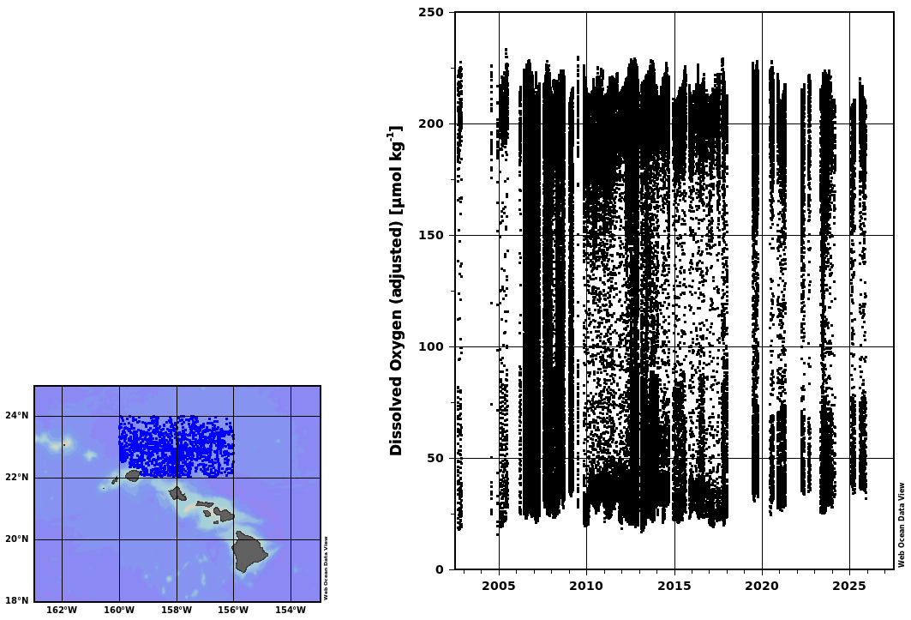
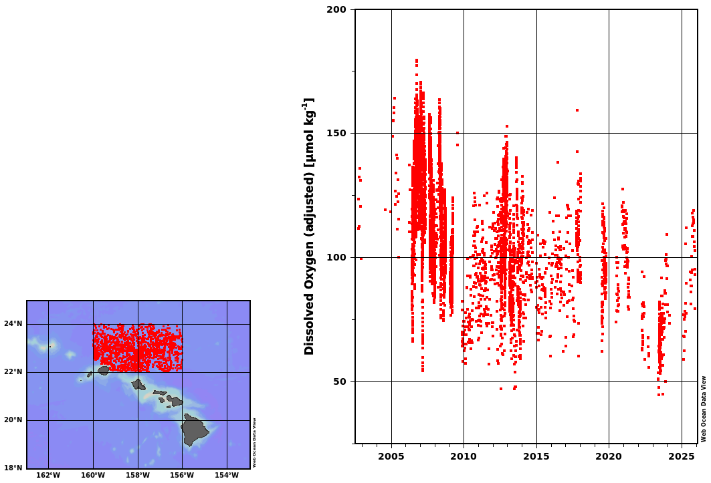
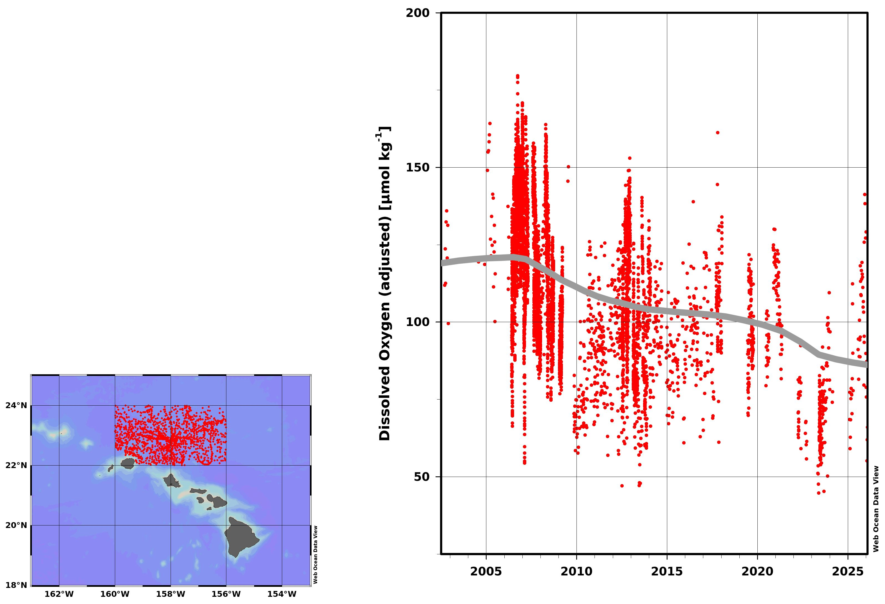

# webodv-cross-server-integration
Step-by-step tutorial on webODV's cross-server integration function.

In this example we show how to use webODV's cross-server integration -
the ability to pull in data from multiple servers and overlay them in
a unified visual and analytical framework.

 
*HOT (station ALOHA, white dot on map) oxygen data between 480 - 520 dbar
are shown as blue dots with an overlaid black moving average
line. Individual BGC Argo oxygen data (red dots on map) for the same
interval retrieved via webODV’s cross-server integration have been
overlaid (red dots plus gray moving average line). The combination of
ship-based Niskin measurements with autonomous float observations
demonstrates how webODV facilitates direct comparison of complementary
datasets without preprocessing or downloading.*

# Open the BGC Argo dataset

In your webbrowser visit https://argo-webodv.vm.fedcloud.eu, and choose
*Ocean->Biogeochemistry->BGC-Argo Global Profiles*, or directly
https://argo-webodv.vm.fedcloud.eu/public/ocean/biogeochemistry/bgc-argo_global_profiles.
On the
next page click on *Data Exploration*.  
Choose *View->Load View->public->AllStationsMap*.  Consider to save your work regularly via right
click on the canvas (white area) and select *Save View As*. Note that the view is saved in your
Browsers cache. To have a real back up, download the view via *View->Manage Resources->Views*, click
on the respective view and on *Download*.

 

## Domain

Right click into the map and choose *Properties*. On the dialog select
*Domain* and enter *West=197*, *East=207*, *North=25*, *South=18* and
click on *Apply*.

## Filter Stations

Again, right click into the map and choose *Station
Filter->Customize*. On the dialog select Domain and enter *West=200*, *East=204*, *North=24*, *South=22*.
Then, on the dialog, select *Availability* and click on *8. Dissolved Oxygen (adjusted) [umol kg-1]*
and click on *Apply*. Right click on the black text on the map and click on *Delete Object* to remove the text.
To jump directly into this intermediate state download this *.xview* file:
[webodv_xservint_filter_stations.xview](webodv_xservint_filter_stations.xview).
In webODV go to *View->Manage Resources->Views->Click to select a view for upload* and choose the *.xview* file from your computer.

 

## Create Scatter Window and Derived Variables

Left click into the white area next to the map (the *canvas*). On the
dialog choose *Layout->Layout Templates->1 SCATTER WINDOW*. Next click
choose *View->Derived Variables*, on the dialog open the *Time* node
and select *Time (station date/time)*. Click *Apply*.  
Right click into the Scatter Window, on the dialog select *X-Variable*
and choose *drvd: Time (station date/time)*. Repeat for *Y-Variable*
and choose *8. Dissolved Oxygen (adjusted) [umol kg-1]*.
Use this *.xview* to access the plot immediately: [webodv_xservint_scatter.xview](webodv_xservint_scatter.xview).

 

## Filter Depth

Right click into the Scatter Window choose *Sample
Filter->Customize*. On the dialog select *Range*. As Variable choose
*2. Pressure (adjusted) [decibar]* and fill the Acceptable Range from
*480* to *520*. Click *Apply*. 

## Full Range, Color and Zoom

Right click into the Scatter Window and choose *Full Range->All*.
Right click into the Scatter Window and open the *Properties*. Goto
*Display Style* click into the *Symbol color* box and choose red color
number *12*. Change the *Symbol size to 12*. Click *Apply*.  Right
click into the Scatter Window again and choose *Zoom*. Move the right
*Zoom rectangle* a bit to the left to remove the gap between data
points and window frame.

Right click into the map
choose *Properties->Display Style* and select color *12* as well.
Respective view file: [webodv_xservint_filter.xview](webodv_xservint_filter.xview).

 

## Apply moving average filter

Right click into the scatter window, select *Statistics->Curve Fitting*. On the pop up window select
*Type->Moving Average*, *Number of grid goints: 30* and *Averaging length scale: 300*. Then click on
*Construct Curve* and on *Show Curve*. Close the pop up. Right click on the just created moving
average line and select *Properties*. Choose *Line->thick* and color *22*. Click on *Apply*.
Respective view file: [webodv_xservint_mv.xview](webodv_xservint_mv.xview).

 

# HOT

Now go to https://hot.webodv.awi.de, choose the *Discrete Water Column* dataset, and click on *Data
Exploration* on the next page, or click directly on
https://hot.webodv.awi.de/public/discrete_water_column/discrete_water_column.
Choose *View->Load View->public->Default*. 

## Filter

Right click on the map, choose *Station Filter->Customize*. Click on *Date/Time* select *Period*
from *Jan 01 1990* to *Dec 12 99999*. Click on *Meta Data*, under *Text Meta Variables* choose
*Site* and type *ALOHA* into the text field. Then click on *Availability* and select *9. Bottle
Dissolved Oxygen*. Click on *Apply*.
Respective view file: [webodv_xservint_hot_filter.xview](webodv_xservint_hot_filter.xview).

 

